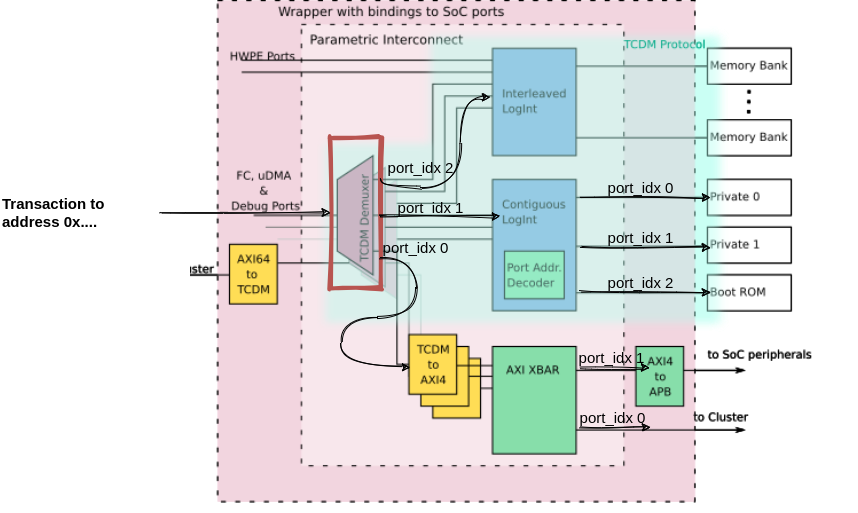

# Instructions
In this rather involved exercise you are going to modify the memory layout of pulpissimo. The default of pulpissimo is to contain the following SRAM banks:
* 4 x 128KB banks for the interleaved memory
* 2 x 32KB private banks for the core In this exercise we are going to change
that. Your task is to increase the total amount of memory for the interlaved
region from 512KB (4x128KB) *to 2MB (8x256KB)*. So not only we are going to
increase the banking factor from 4 to 8 and increase the size of each
interleaved bank to 256Kb = 65536 32-bit words. Furthermore, you will add a new
private SRAM bank to the system with a size of *32KB = 8192 32-bit words*.
If you feel stuck, don't hesitate to ask us for help.

# RTL Modification Instructions
## Changing Interleaved RAM layout
1. Change the banking factor in pulp_soc. Modify the
   macro. Don't just hardcode the value.
   > Hint: The relevant parameter is called `NB_L2_BANKS`.
2. Decrease size of each bank to 8192 32-bit words (you need to change
   localparam both in `pulp_soc.sv` as well as in `l2_ram_multibank.sv`)
3. Make sure to also modify the bank size for the fpga port (`fpga_settings.mk` in
   the corresponding board directories).
4. Modify the address space start/end addresses for the L2_MEMORY region
   (`<pulpissimo>/rtl/includes/soc_mem_map.svh`). Have a closer look at the
   `soc_interconnect_wrap.sv` module to understand how it works and how the
   macro values are applied to the parametric interconnect
   (`soc_interconnect.sv`).
   > Hint: The relevant macro for address space is called `SOC_MEM_MAP_TCDM_START_ADDR`
## Adding an additional private SRAM bank
 1. Define a new memory region for the new memory bank with a size of 2kB (same size as the existing private banks). The start address of the new memory region shall be `0x1b000000`.
 >Hint: Modify `<pulpissimo>/rtl/includes/soc_mem_map.svh` to achieve this.
 2. Instantiate the third private bank in `l2_ram_multibank.sv` and attach it to
    a new, dedicated port. 
    >Hint: You could in theory just increase the size of the `mem_pri_slave` interface array. But for this exercise, create a dedicated additional port call it e.g. `additional_mem_pri_slave`.
3. Modify `soc_interconnect_wrap.sv` for the additional SRAM bank:
   - Add a new dedicated port to the portlist of `soc_interconnect_wrap.sv`
   - Increase the number of contiguous slave ports of the parametric interconnect from 3 to 4 (`soc_interconnect.sv` that is instantiated with `soc_interconnect_wrap.sv`). Do not forget to also increase the size of the wiring signal (`contiguous_slaves`, line 152).
   - Modify the address rule of the interconnect. You will have to modify both,
     the address rules for the TCDM demultiplexer and the contiguous crossbar
     using the macros you defined in step 1. The following illustration of the
     `soc_interconnect` might help:
     
      
     
     Dont forget to increase the number of address rules parameters when you add the rules for the new memory bank.
   >Hint: The same applies as for point 2, you could increase the size of the interface arry but we do it with a dedicated port for this exercise.
4. In `pulp_soc.sv` the additional wiring signal to connect the new output port
   of the `soc_interconnect_wrap.sv` to the new port of `l2_ram_multibank.sv`.
5. Since we didn't add any new files nor added new IPs, we don't have to
   regenerate the TCL scripts for compilation. However, we obviously have to
   recompile the source files after modifying them. To do so run the following
   command in the toplevel of pulpissimo.
   
   ``` shell
   make clean build 
   ```
   >Hint: Although not strictly necessary in this case it is always a good idea to run the clean target as well since modifications to the TCL script when running `./generate_scripts` are not properly captured by the make target and you might end up with outdated module versions if you just run the `build` target.


## Adjusting the linkerscript
   Now that we have a different memory layout, we need to tell the linkerscript
   about it. In this part, we accomodate for the larger L2 memory, add a new
   memory section for the additional private bank and finally try to map some
   interesting sections to this new private bank.

   1. Extend the existing L2 memory region to match the size of the
   new interleaved region

   2. Add a new memory region for the third private bank

   3. Map the .bss section to the new private bank. Confirm the mapping by
   inspecting the executable with `riscv32-unknown-elf-readelf` or
   `riscv32-unknown-elf-nm`. You should see that the section is being mapped to
   the address range of the new private bank. You can use the provided
   `link_test.c` in the `link_test` subdirectory program to see if your changes
   to the linkerscript are correctly reflected in the compiled program.

## Test your modications on the hardware
  1. Switch to the mem_test subdirectory of this repository and compile the application.
  2. Run the application on your modified hardware. Make sure you did not forget
     to compile your modified pulpissimo beforehand. Also make sure that your
     `VSIM_PATH` environment variable points to the right location.
     
     Start the simulation in gui mode so you can see what's going on:
     
     ``` shell
     make clean all run gui=1
     ```
  3. If you modified everything correctly, you should see a number of success
     print statements in the log and the programm should terminate with exit
     code 0. If this is not the case, check the log output of the simulation and
     use the wave window in Questasim to debug your modifications. A good set of
     signals to add for debugging would be the 8 interleaved memory bank ports
     and the port of the additional private memory bank entering
     `l2_ram_multibank.sv`. Besides that it is always helpfull to add the
     soc_interconnect and the core instruction signals to the waveform view:
     
     ``` tcl
     do waves/soc_interconnect_wrap.tcl
     do waves/software.tcl
     ```
